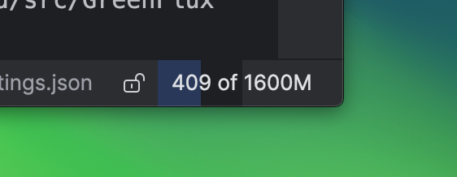
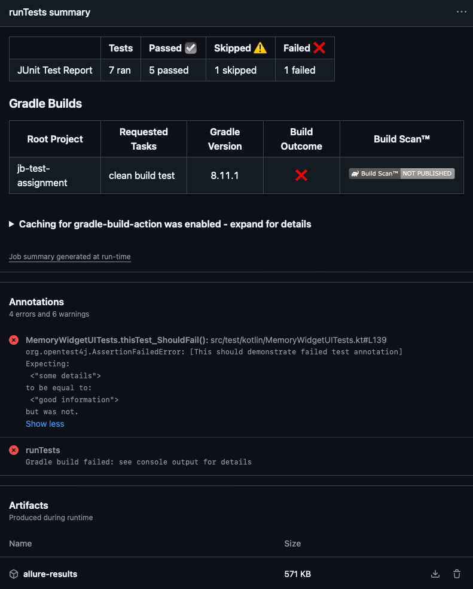

# JetBrains Test Assignment
[](https://github.com/kirillburton/jb-test-assignment/actions/workflows/gradle-test.yml)

## 📋 Assignment description:
**Test assignment: Experiment with R# or Rider integration testing.**
"Test some R# or Rider feature on ci/cd. For example, "Show manage memory in status bar"

- you can choose any CI/CD tool to run tests (including writing your own)
- test scenarios at the discretion of the person performing the task

The "Show manage memory in status bar" feature is in the ReSharper -> Options...-> General menu"



---

## ✅ What has been done

This project demonstrates automated UI testing of Rider IDE using the [intellij-ide-starter](https://github.com/JetBrains/intellij-ide-starter) framework.  
Mostly focuses on verifying the "Show Memory Indicator" widget UI behavior in the status bar.
It is NOT inteded to provide full feature test coverage, only a skeleton with some experiments.

The project then was tuned to run on CI/CD platform - Github Actions in this case.  
There it reports failed test results with exception information as annotations.  
See more details in the [CI run](#☁️-ci-run) section.

#### Key components:
- utilizes the driver extension for IDE Starter Framework
- tests Rider 2024.2 release
- verifies memory indicator widget UI in the status bar
- includes setup helpers for test configuration and IDE initialization
- handles license management for automated testing
- provides some XML configuration templates for IDE settings

#### The tests validate that the memory indicator widget:
1. can be enabled via XML configuration
2. appears in the IDE status bar
3. remains hidden when disabled in settings
4. shows additional information when mouse hovers over it
5. can be enabled/disabled via status bar popup menu
6. can be toggled via Search Everywhere
7. garbage collection functionality is working (at least in the UI) 

---

## ⏳ What can be done further

1. Test Coverage Expansion:
   - test memory usage indicator accuracy - utilize IDE memory usage API if available
   - check that XML settings are modified as a result of the UI change
   - check settings persistence after restart
   - backend memory indicator coverage
   - verify widget behavior under different memory load conditions
   - add tests for widget interaction with other status bar components
   - do parametrization of IDE versions and configurations
   - implement XML configurator/reader instead of hardcoded values OR utilize existing configurator that I haven't discovered
   - check the widget can be enabled/disabled via main menu view section
   - some scenarios that I haven't thought of immediately


2. Framework integration: 
   - use some of the existing UI components instead of custom ones
   - contribute to testing framework to have more reusable UI components and configuration options
   - better page-object pattern implementation
   - more secure/unique locators for UI elements
   - implement test reporting utilizing allure machinery for more detailed reports
   - enhance and or clean up logging for better test debugging


3. CI/CD Enhancements:
   - add parallel test execution support
   - implement cross-platform testing (use self-hosted runners for Windows and macOS because of the accessibility and securityissues)
   - add performance testing metrics
---

## 📁 Project description

### Key Files

1. Test Implementation:
   - `src/test/kotlin/MemoryIndicatorTest.kt` - Main test class containing all test scenarios
   - `src/test/kotlin/setup/setupHelpers.kt` - Helper functions for IDE and test configuration setup
   - `src/test/kotlin/ui/MemoryIndicatorWidget.kt` - Page object representing the memory indicator widget
   - `src/test/kotlin/ui/StatusBar.kt` - Page object for IDE status bar interactions


2. Configuration Files:
   - `testData/riderConfigs/options/ide.general.xml` - General IDE settings xml configuration with widget visibility field
   - `testData/riderConfigs/options/trustedSolutions.xml` - Generated trusted solution xml configuration
   - `testData/riderConfigs/options/trusted-paths.xml` - Generated trusted paths xml configuration


3. Build and CI:
   - `build.gradle.kts` - Project dependencies and build configuration
   - `.github/workflows/gradle-test.yml` - GitHub Actions workflow definition

---

## ☁️ CI run

Available via Github Actions workflow ```gradle-test.yml``` on pushes and PRs to 'main' branch.

- runs on Ubuntu
- executes Gradle clean build test
- Rider license key is passed securely via github secrets to enable automated testing
- publishes short test result statistics (ran, passed, skipped, failed)
- on test failure: 
  - creates annotations with detailed exception information from logs
  - uploads 'allure-results' as artifacts

Example report:  




___

## 💻 Local run

### macOS and Linux:
- Make sure you have Java/Gradle installed
- Take care of a Rider license:  
  0. If you already have Rider license activated on you machine, skip to step 4.
  1. Go to your JetBrains Account
  2. Click "Download a code for offline activation" 
  3. Activate license in IDE (Help|Register) 
  4. Run ```base64 -i <config_folder>/Rider.key``` where <congig_folder> is your configuration folder*, copy the result
  5. Run ```export RIDER_KEY=<your_key>```
  6. Now Gradle build should be able to fetch license from there
  7. If there are problems with the env variable, but you have license already applied and in your config files, you can just comment out:
     - The [`riderLicenseKey` declaration](../../blob/main/src/test/kotlin/setup/setupHelpers.kt#L28) at the top of `setupHelpers.kt`
     - The [`.setLicense(riderLicenseKey)`](../../blob/main/src/test/kotlin/setup/setupHelpers.kt#L41) line in the `setupTestContext` function
- Run ```./gradle clean build``` - this should run the tests
- During the first run on **macOS** you'll be prompted to allow some accessibility options, this is mandatory for local automation execution

### Windows:
- Make sure you have Java/Gradle installed
- Take care of a Rider license:  
  0. If you already have Rider license activated on your machine, skip to step 4.
  1. Go to your JetBrains Account
  2. Click "Download a code for offline activation" 
  3. Activate license in IDE (Help|Register) 
  4. Run ```certutil -encode <config_folder>\Rider.key encoded.txt``` where <config_folder> is your configuration folder*, then open encoded.txt and copy the content between the BEGIN and END lines
  5. Set the environment variable: ```set RIDER_KEY=<your_key>``` (or set it via System Properties in Windows)
  6. Now Gradle build should be able to fetch license from there
  7. If there are problems with the env variable, but you have license already applied and in your config files, you can just comment out:
     - The [`riderLicenseKey` declaration](../../blob/main/src/test/kotlin/setup/setupHelpers.kt#L28) at the top of `setupHelpers.kt`
     - The [`.setLicense(riderLicenseKey)`](../../blob/main/src/test/kotlin/setup/setupHelpers.kt#L41) line in the `setupTestContext` function
- Run ```gradlew.bat clean build``` - this should run the tests
- During the first run you might need to allow Windows Defender or your antivirus to permit UI automation

\* – for configuration folder see [Directories used by IDE](https://intellij-support.jetbrains.com/hc/en-us/articles/206544519-Directories-used-by-the-IDE-to-store-settings-caches-plugins-and-logs)

___

## ⛔️ Limitations

- This approach only works from Intellij-based IDEs versions starting from 2024.2+
- Haven't found the proper way of opening project without IDE prompting dialog to open it as a directory or as a solution, this adds execution time 
- Current implementation of the widget tests works with IDE restart which adds execution time
- macOS requires granting accessibility permissions for UI automation
- Windows may require security/antivirus exceptions for UI automation
- A valid JetBrains Rider license is required (see setup instructions above)
